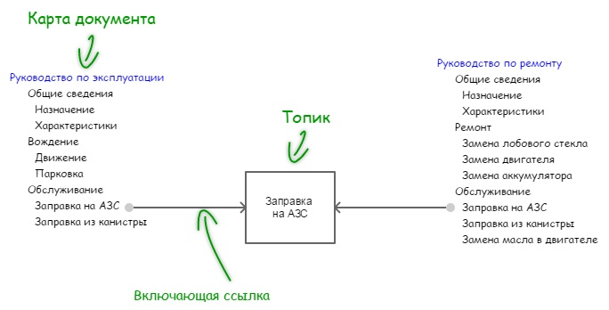
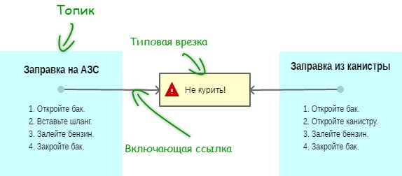

# Стандарт DITA

**DITA (Darwin Information Typing Architecture)** – стандарт на базе XML, предназначенный для разработки, структурирования и публикации технической документации. Создан IBM с целью упрощения повторного использования и фильтрации контента.

**Основные сущности DITA:**

- **Топик**. Озаглавленный блок информации, который может быть понят в отдельности от других блоков и используется в различных контекстах. Раскрывает один конкретный вопрос.
- **Карта**. Определяет набор, последовательность и состав топиков, которые должны быть включены в поставку (конечный документ). Можно использовать фильтры (условные конструкции).
- **Выходные форматы**. Поставку можно осуществить в docx, pdf, html и других форматах. Механизм публикации DITA включает форматирование текста, разметку страницы и т.д.

### Концептуальная визуализация DITA


### Пример карты документа
``` xml
<?xml version="1.0" encoding="UTF-8"?>
<!DOCTYPE map PUBLIC "-//OASIS//DTD DITA Map//EN" "map.dtd">
<map id="modSaragosaDatasheet" xml:lang="ru">
   <title>Электромобиль «<keyword keyref="prodName"/> 
   <keyword keyref="modName"/>»</title>
	
   <!-- Включающие ссылки на выносные карты -->
   <mapref href="Common/prodkeys.ditamap"/>
   <mapref href="Saragosa/modkeys.ditamap"/>
	
   <!-- Включающие ссылки на топики -->
   <topicref href="Common/topics/overview.dita"/>
   <topicref href="Common/topics/generalView.dita"/>
   <topicref href="Common/topics/techParams.dita"/>
</map>
```

### Пример типовой врезки
``` xml
<note id="noteSafety" type="important">
    <p>Электромобиль — современное экологически чистое транспортное 
       средство повышенной опасности. Перед использованием электромобиля 
       ознакомьтесь с разделом «Безопасность».</p>
</note>	
<note id="noteSafetyMnt" type="important">
    <p>Электромобиль — современный технически сложный подвижной электромеханический 
       прибор. Перед обслуживанием электромобиля ознакомьтесь с разделом 
       «Безопасность».</p>
</note>
```