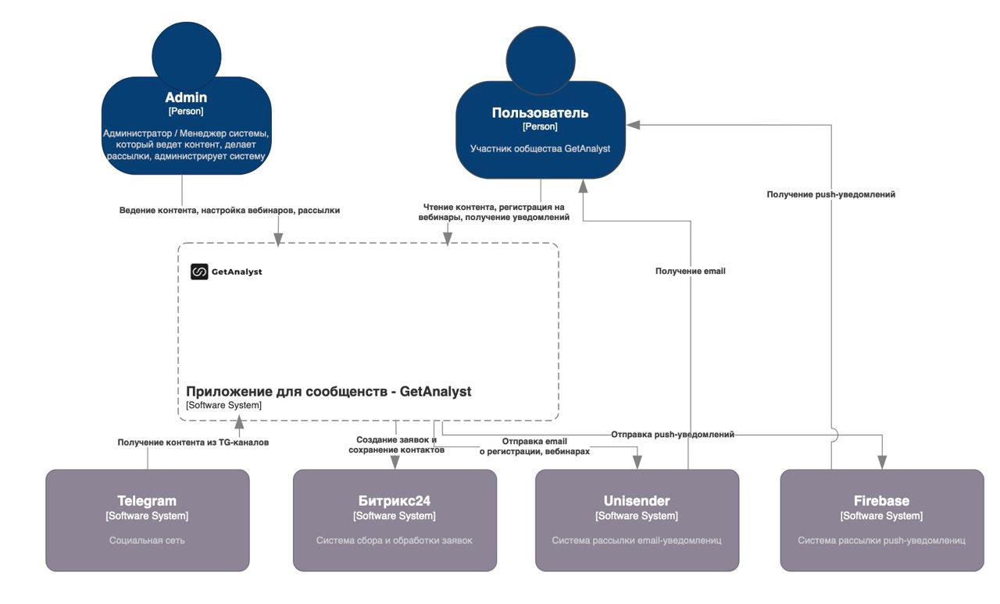

# Нотация C4

**C4** – нотация моделирования архитектуры. Включает четыре уровня:

- **Context.** Общее представление и интеграции.
- **Container.** Устройство системы и виды софта (web, mobile, server).
- **Component.** Основной уровень, описывает Backend.
- **Code.** Взаимодействие сервисов и алгоритмы.

### Концептуальная визуализация

### Пример визуализации проекта по модели C4
