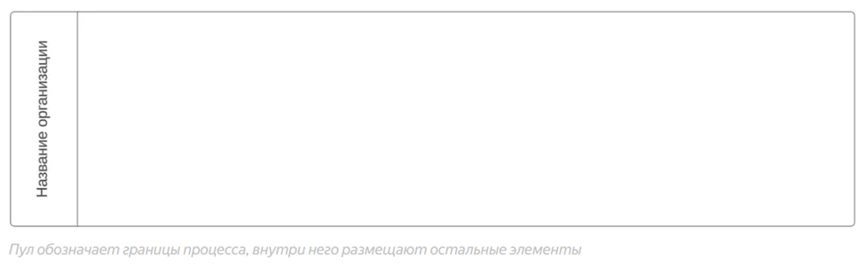
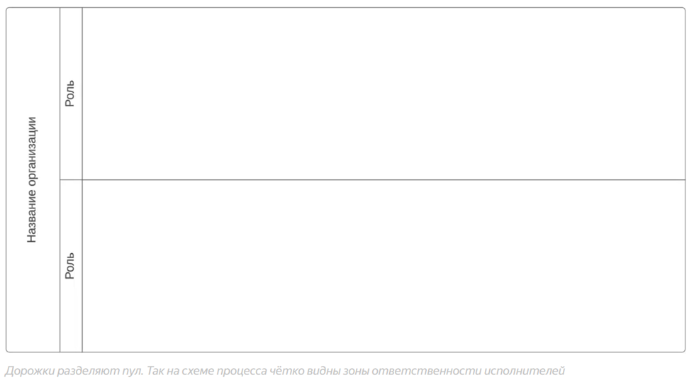
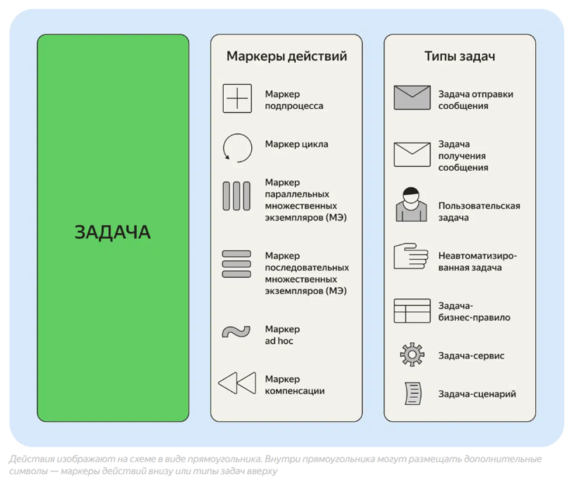
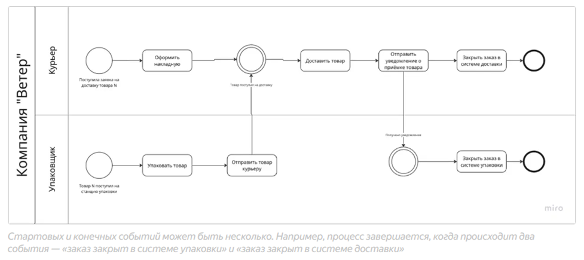
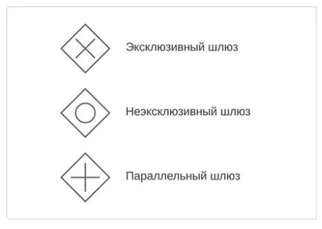
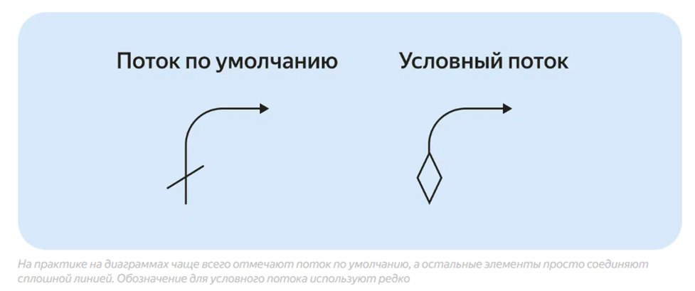
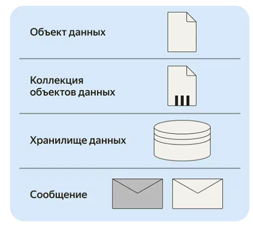

# Нотация BPMN

**BPMN (Business Process Model and Notation)** – язык моделирования бизнес-процессов.

>С 2010 года используется BPMN 2.0.
## Элементы BPMN

**Пул (Pool)** – область, в которой протекает процесс.

**Дорожка (swimlane)** – элемент для отображения исполнителей процесса. Если пул – организация, то дорожки – отделы.

**Действия/задачи.** Все активности исполнителей. Например, заказ обрабатывают сотрудники отдела продаж, склада и доставки. Первые принимают заказ, вторые собирают, третьи – доставляют покупателю.

**События.** Всё, что происходит в рамках процесса, отмечают на диаграмме в виде круга. Событие отличается от действия тем, что действие подразумевает активность исполнителя, а событие – случившийся факт. Например, «внести заявку в базу» – действие, а «письмо получено» – событие. Выделяют три вида событий:

- **Стартовое** – то, с чего начинается процесс. Например, получена заявка с сайта на обратный звонок. На диаграмме стартовое событие обозначают кругом с тонкой линией ободка.
- **Конечное** – то, чем заканчивается процесс. Например, договор подписан. На схеме событие отмечают кругом с жирной линией ободка.
- **Промежуточное** – всё, что происходит по ходу процесса. Например, получен ответ на коммерческое предложение, согласован договор. Промежуточные события обозначают кругом с двойным ободком.

**Шлюзы** – точки принятия решений. Выделяют три типа шлюзов:

- **Эксклюзивный шлюз** («строгое ИЛИ») – дальше процесс может пойти только по одному из направлений. Обычно задаётся условие, например, оплатил клиент заказ или нет.
- **Неэксклюзивный шлюз** («нестрогое ИЛИ) – процесс может пойти по нескольким путям, но не обязательно по всем сразу. Например, пользователь оформляет на сайте доставку с самовывозом из пункта выдачи заказов. И оставляет контактные данные: номер телефона, адрес в мессенджере, email. От того, какие способы связи укажет пользователь, зависит способ отправки уведомления о том, что посылку можно забирать.
- **Параллельный шлюз** используют для ветвления или слияния потоков процесса. Если это шлюз ветвления, дальше обязательно должно произойти несколько событий. Если шлюз слияния, процесс двинется дальше, только когда завершатся несколько параллельных действий. Например, чтобы отправить договор на подпись подрядчику, его обязательно должны согласовать юридический отдел, бухгалтерия и генеральный директор.

**Связи** – объединяют действия/задачи, события и шлюзы. Внутри одного пула стрелки сплошные, между пулами стрелки пунктирные. Выделяют два типа связей:

- **Поток по умолчанию** отмечается стрелкой с косой линией в начале. Отметка указывает, по какому пути пойти, если не будет новых данных. Например, если пользователь не выбрал способ получения чека, чек по умолчанию печатают и прикладывают к заказу. Поток по умолчанию обязательно используют при работе с неэксклюзивным шлюзом: когда есть несколько возможных вариантов развития событий.
- **Условный поток** обозначают небольшим ромбом в начале стрелки. Символ указывает, что для следующего действия должно быть выполнено какое-то условие. Например, чтобы отправить чек по электронной почте, пользователь должен указать email.

**Артефакты** – данные, которые используются или появляются в рамках процесса. Например, документы, письма, БД.

