# Нотация UML (SD)

**UML (Unified Modeling Language)** – унифицированный язык моделирования системных и бизнес-процессов.

**SD (Sequence Diagram)** – диаграмма последовательностей. Визуализирует взаимодействие между объектами в системе, показывает порядок сообщений, которыми объекты обмениваются во времени, и их жизненный цикл.

**Диаграмма последовательностей состоит из следующих элементов:**

- **объекты** (зеленое);
- **линии жизни** (красное);
- **сообщения** (синее).

<figure markdown="span">
  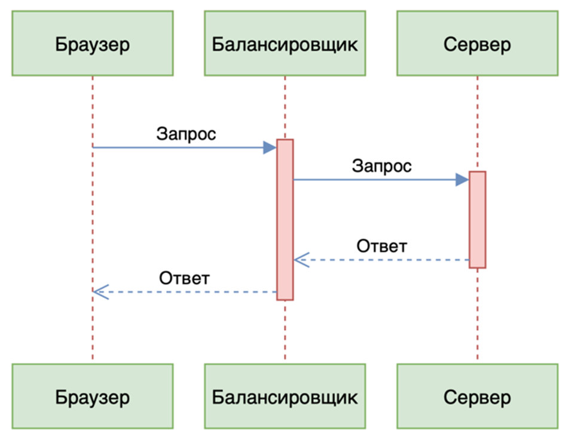{ width="500" }
</figure>

### Объекты
Сущности, которые взаимодействуют друг с другом. Основные типы объектов:
- **actor** – пользователь или «клиент»;
- **participant** – сервер, компонент системы;
- **database** – база данных;
- **queue** – топик или очередь.

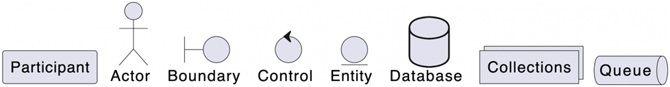

### Линии жизни
Отображают течение времени, а также активность или исполнение определенных функций объекта. Представляют из себя вертикальную линию с блоком активности.

### Сообщения
Показывают обмен информацией между объектами. Например, клик пользователя по кнопке, но чаще это запрос или ответ, вызов хранимой процедуры или отправка сообщения. Сообщения отображаются в виде стрелок. Вид стрелки определяет тип сообщения:
<figure markdown="span">
  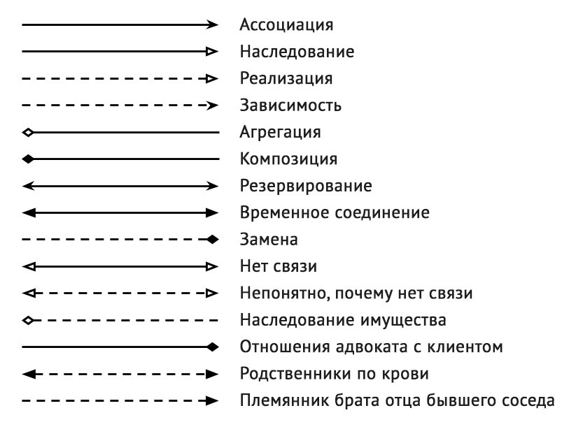{ width="600" }
</figure>

**Инструменты для работы с UML SD**

- графический редактор **draw.io**;
- песочница **PlantUML**;
- плагины в инструментах **JetBrains** или **VSCode**.

## Синтаксис PlantUNL

### Определяем объекты
```html
actor "Пользователь" as u
participant "Фронт" as f
participant "Бэк" as b
```
### Описываем сообщения
```plantuml
u -> f
f -> b
b -->> f
f -->> u
```

Основные типы стрелок:
```plantuml
a ->> b: Асинхронный вызов
a -> b: Синхронный вызов
a -->> b: Ответ
a -x b: Запрос, который будет удален
```
Визуализация:

<figure markdown="span">
  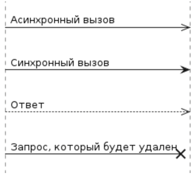{ width="250" }
</figure>

### Группируем сообщения
**Группировка Alt** используется с оператором else для того, чтобы показать альтернативные кейсы взаимодействия. Например, объект отправляет запрос, а второй объект, в зависимости от полученных данных, выполняет разные действия.
```plantuml
alt case 1
  a -> b
else case 2
  a -> c
end
```
Визуализация:

<figure markdown="span">
  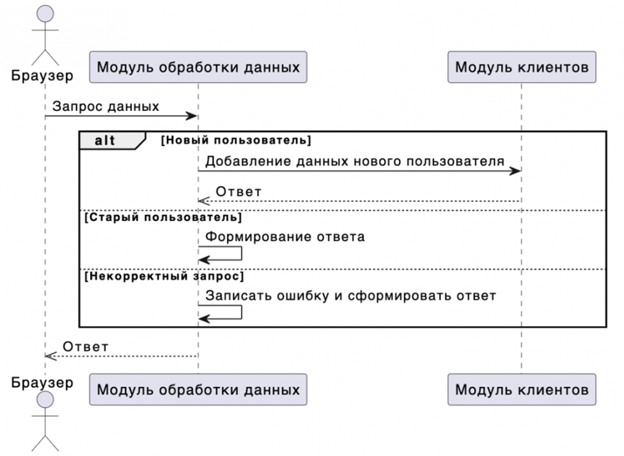{ width="600" }
</figure>

**Группировка Opt** используется для того, чтобы выделить сообщение в опциональный кейс. Например, объект отправляет запрос, а второй объект, в зависимости от полученных данных, может выполнить дополнительное действие.
```plantuml
opt
  a -> c
end
```
Визуализация:

<figure markdown="span">
  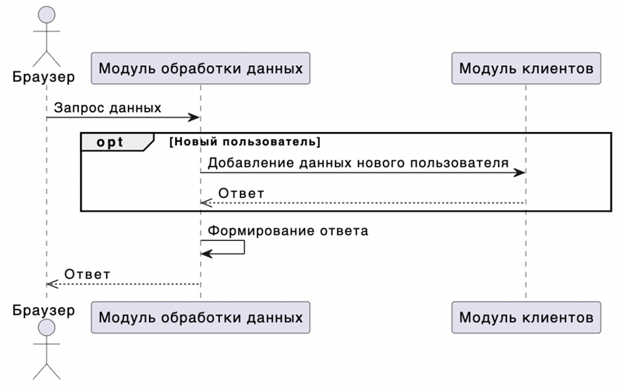{ width="600" }
</figure>

**Группировка Par** используется с оператором else для того, чтобы выделить сообщения, которые выполняются параллельно. Например, объект отправляет запрос, а второй объект параллельно выполнит внутренние вычисления и вернёт ответ первому объекту.
```plantuml
par
  a -> b
else
  a -> c
end
```
Визуализация:

<figure markdown="span">
  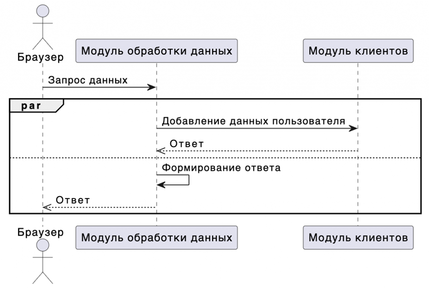{ width="600" }
</figure>

**Группировка Loop** используется для того, чтобы выделить сообщения, которые выполняются несколько раз. Например, объект отправляет запрос, а второй объект выполнит внутренние действия несколько раз в зависимости от отправленных данных.
```plantuml
loop
  a -> c
end
```
Визуализация:

<figure markdown="span">
  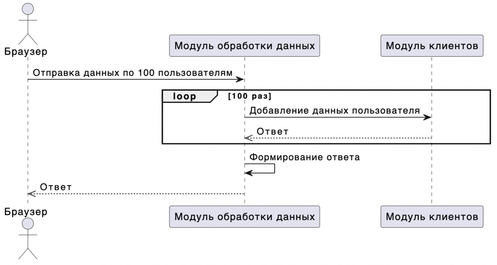{ width="600" }
</figure>

**Группировка Group** используется для того, чтобы скомпоновать сообщения по смыслу. Например, на диаграмме может быть много взаимодействий и для того, чтобы было меньше путаницы можно подписать группы сообщений.
```plantuml
group
  a -> c
end
```
Визуализация:

<figure markdown="span">
  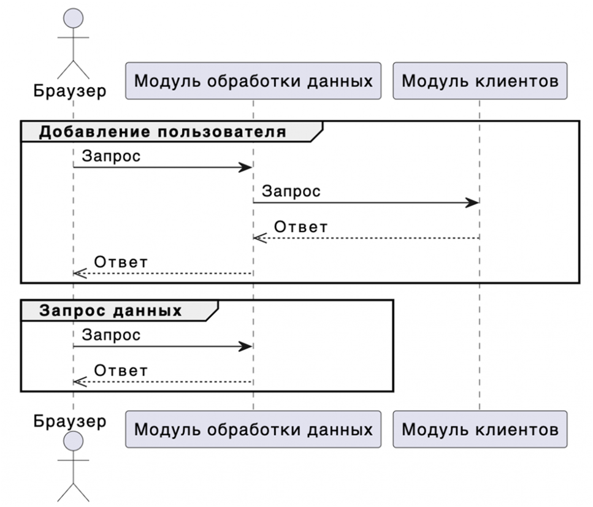{ width="600" }
</figure>

**Можно группировать сами объекты.** Часто используется для описания взаимодействия нескольких систем с микросервисами.
```plantuml
box Название
  participant "Название 1"
  participant "Название 2"
box end
```
Визуализация:

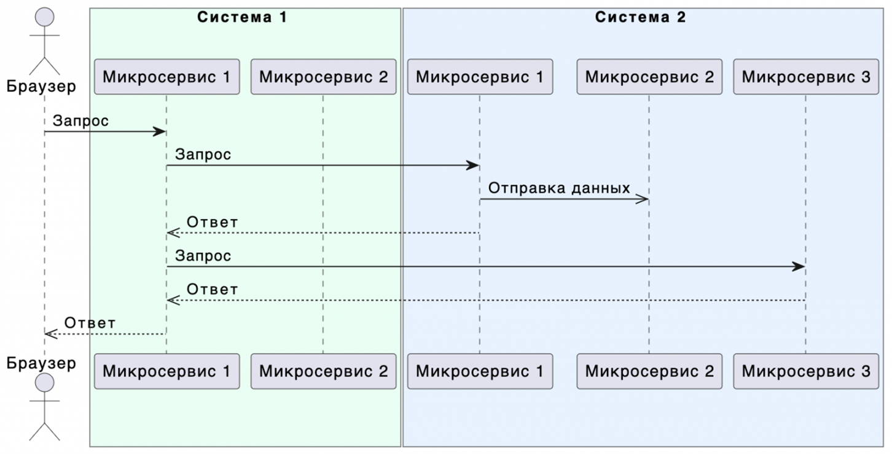

## Полезные возможности PlantUML
### Изменить цвет стрелок
```plantuml
-[#blue]>
-[#ff00ff]>
```
Визуализация:

<figure markdown="span">
  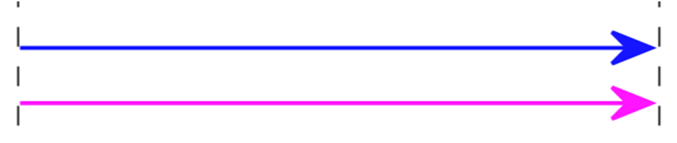{ width="200" }
</figure>


### Изменить цвет текста
```plantuml
A -> B: <color #f0f>Запрос</color>
B -->> A: <color #green>Ответ</color>
```
Визуализация:

<figure markdown="span">
  ![Цветной текст]images/StandartsNotations4-12.png){ width="300" }
</figure>

### Добавить подсказку
```plantuml
note right
  REST: **some.adress.com:433/new**
end note
```
Визуализация:

<figure markdown="span">
  ![Подсказка]images/StandartsNotations4-13.png){ width="500" }
</figure>

### Поставить разделительную черту
```plantuml
== Сохранение данных ==
```
Визуализация:

<figure markdown="span">
  ![Разделительная черта]images/StandartsNotations4-14.png){ width="500" }
</figure>

## Пример разработки SD в PlantUML
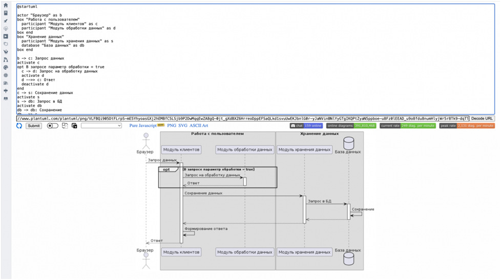