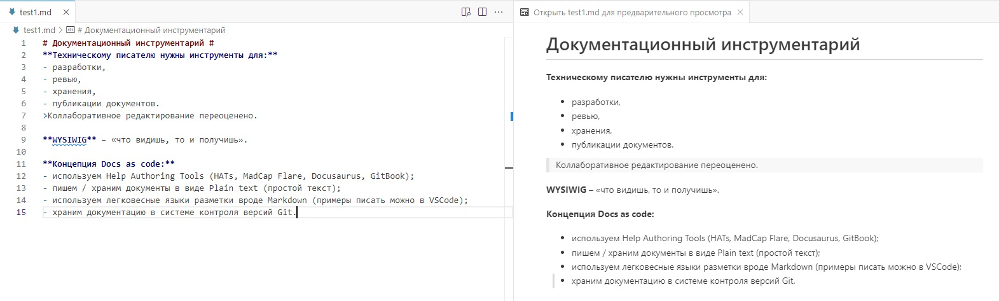

# Документационный инструментарий

**Техническому писателю нужны инструменты для:**

- разработки,
- ревью, 
- хранения,
- публикации документов.

>Коллаборативное редактирование переоценено.

**WYSIWIG** – «что видишь, то и получишь». Пример разработки md-файла в VS Code:

**Концепция Docs as code:**

- используем **Help Authoring Tools** (Docusaurus, MkDocs, GitBook, Readme);
- пишем / храним документы в виде **Plain text** (простой текст);
- используем легковесные языки разметки вроде **Markdown** (пишем в **VSCode** или другой IDE);
- храним документацию в системе контроля версий **Git**.